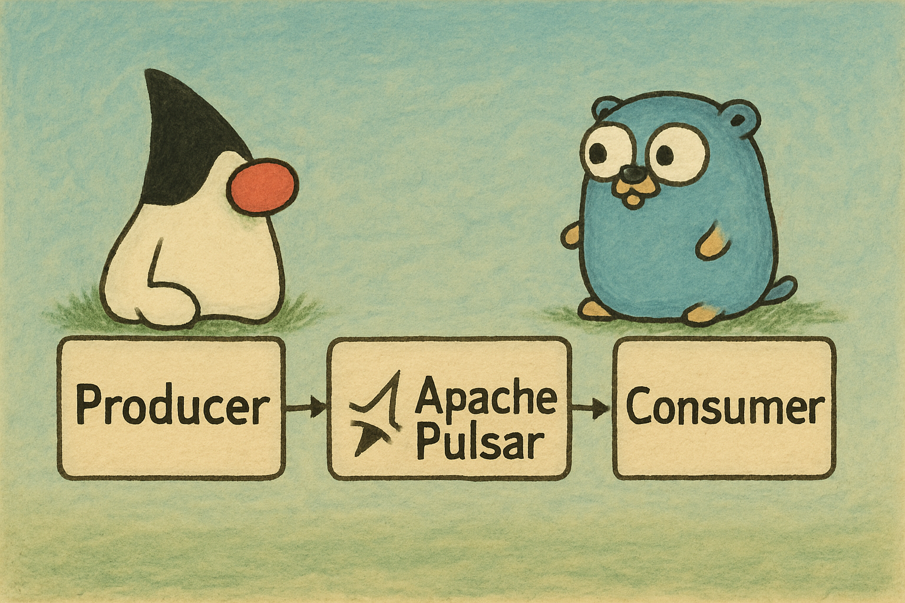

# Apache Pulsar Demo

Demonstration repository showcasing integration between Java and Go applications using Apache Pulsar as a messaging system.



## Table of Contents

1. [Description](#description)   
2. [Projects](#projects)  
3. [How to Run](#how-to-run)  
4. [Requirements](#requirements)

---

## Description

This repository contains two main projects:
- **java-producer**: Publishes messages to Apache Pulsar.
- **golang-consumer**: Consumes messages from Apache Pulsar.

## Projects

- [`java-producer`](java-producer): Java application for message production.
- [`golang-consumer`](golang-consumer): Go application for message consumption.

## How to Run

1. Start the environment with Docker Compose:
```bash
docker compose -f pulsar-componse.yaml up --build
```

2. Access the Pulsar dashboard at http://localhost:9527.

## Requirements
Docker and Docker Compose

Java 23 (for producer development)

Go 1.18+ (for consumer development)